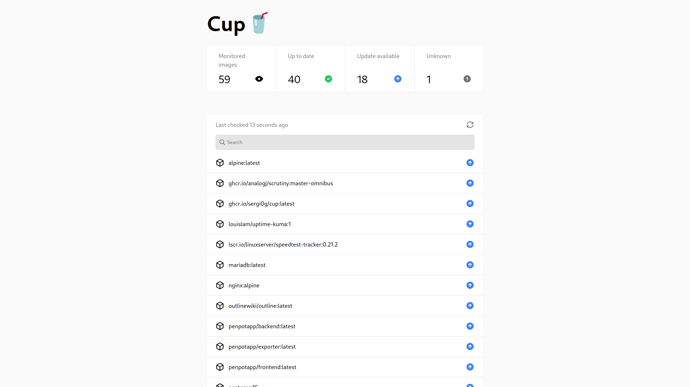
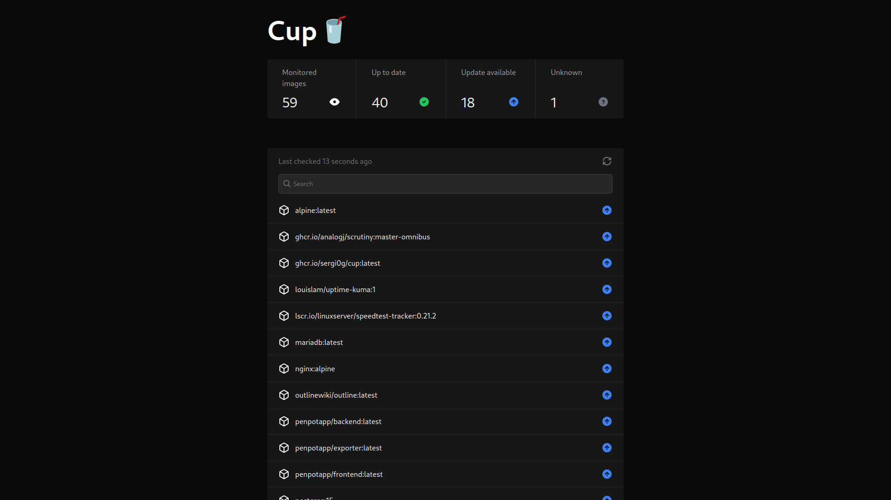

# Cup 🥤

Cup is the easiest way to check for container image updates.

_If you like this project and/or use Cup, please consider starring the project ⭐. It motivates me to continue working on it and imrpoving it. Plus, you get updates for new releases!_

## Screenshots

## Features

- Extremely fast. Cup takes full advantage of your CPU and is hightly optimized, resulting in lightning fast speed. On my test machine, it took ~12 seconds for ~95 images.
- Supports most registries, including Docker Hub, ghcr.io, Quay, lscr.io and even Gitea (or derivatives)
- Doesn't exhaust any rate limits. This is the original reason I created Cup. It was inspired by [What's up docker?](https://github.com/fmartinou/whats-up-docker) which would always use it up.
- Beautiful CLI and web interface for checking on your containers any time.
- The binary is tiny! At the time of writing it's just 5.1 MB. No more pulling 100+ MB docker images for a such a simple program.
- JSON output for both the CLI and web interface so you can connect Cup to integrations. It's easy to parse and makes webhooks and pretty dashboards simple to set up!

## Documentation

Take a look at https://sergi0g.github.io/cup/docs!

## Limitations

Cup is a work in progress. It might not have as many features as What's up Docker. If one of these features is really important for you, please consider using another tool.

- ~~Cup currently doesn't support registries which use repositories without slashes. This includes Azure. This problem may sound a bit weird, but it's due to the regex that's used at the moment. This will (hopefully) be fixed in the future.~~
- ~~Cup doesn't support private images. This is on the roadmap. Currently, it just returns unknown for those images.~~
- Cup cannot trigger your integrations. If you want that to happen automatically, please use What's up docker instead. Cup was created to be simple. The data is there, and it's up to you to retrieve it (e.g. by running `cup check -r` with a cronjob or periodically requesting the `/json` url from the server)

## Roadmap
Take a sneak peek at what's coming up in future releases on the [roadmap](https://github.com/users/sergi0g/projects/2)!

## Contributing

All contributions are welcome!

Here are some ideas to get you started:

- Fix a bug from the [issues](https://github.com/sergi0g/cup/issues)
- Help improve the documentation
- Help optimize Cup and make it even better!
- Add more features to the web UI

For more information, check the [docs](https://sergi0g.github.io/cup/docs/contributing)!

## Support

If you have any questions about Cup, feel free to ask in the [discussions](https://github.com/sergi0g/cup/discussions)!

If you find a bug, or want to propose a feature, search for it in the [issues](https://github.com/sergi0g/cup/issues). If there isn't already an open issue, please open one.

## Acknowledgements

Thanks to [What's up Docker?](https://github.com/fmartinou/whats-up-docker) for inspiring this project.
