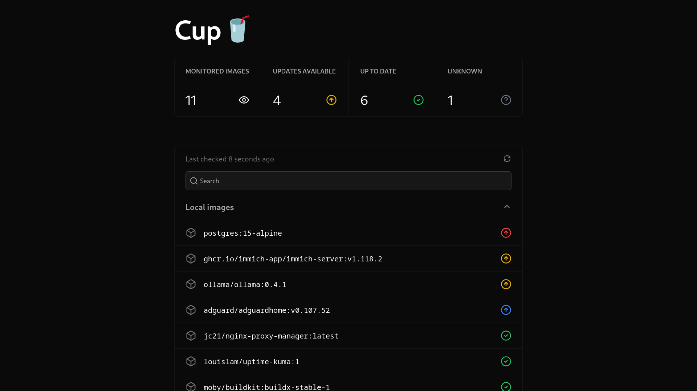

# Cup 🥤

Cup is the easiest way to check for container image updates.

_If you like this project and/or use Cup, please consider starring the project ⭐. It motivates me to continue working on it and improving it. Plus, you get updates for new releases!_

## Screenshots 📷

## Features ✨

- Extremely fast. Cup takes full advantage of your CPU and is hightly optimized, resulting in lightning fast speed. On my Raspberry Pi 5, it took 3.7 seconds for 58 images!
- Supports most registries, including Docker Hub, ghcr.io, Quay, lscr.io and even Gitea (or derivatives)
- Doesn't exhaust any rate limits. This is the original reason I created Cup. I feel that this feature is especially relevant now with [Docker Hub reducing its pull limits for unauthenticated users](https://docs.docker.com/docker-hub/usage/).
- Beautiful CLI and web interface for checking on your containers any time.
- The binary is tiny! At the time of writing it's just 5.4 MB. No more pulling 100+ MB docker images for a such a simple program.
- JSON output for both the CLI and web interface so you can connect Cup to integrations. It's easy to parse and makes webhooks and pretty dashboards simple to set up!

## Documentation 📘

Take a look at https://cup.sergi0g.dev/docs!

## Limitations

Cup is a work in progress. It might not have as many features as other alternatives. If one of these features is really important for you, please consider using another tool.

- Cup cannot directly trigger your integrations. If you want that to happen automatically, please use What's up Docker instead. Cup was created to be simple. The data is there, and it's up to you to retrieve it (e.g. by running `cup check -r` with a cronjob or periodically requesting the `/api/v3/json` url from the server).

## Roadmap
Take a sneak peek at what's coming up in future releases on the [roadmap](https://github.com/users/sergi0g/projects/2)!

## Contributing

All contributions are welcome!

Here are some ideas to get you started:

- Fix a bug from the [issues](https://github.com/sergi0g/cup/issues)
- Help improve the documentation
- Help optimize Cup and make it even better!
- Add more features to the web UI

For more information, check the [docs](https://cup.sergi0g.dev/docs/contributing)!

## Support

If you have any questions about Cup, feel free to ask in the [discussions](https://github.com/sergi0g/cup/discussions)! You can also join our [discord server](https://discord.gg/jmh5ctzwNG).

If you find a bug, or want to propose a feature, search for it in the [issues](https://github.com/sergi0g/cup/issues). If there isn't already an open issue, please open one.

## Acknowledgements

Thanks to [What's up Docker?](https://github.com/getwud/wud) for inspiring this project.
